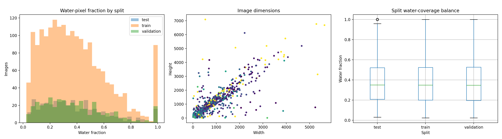
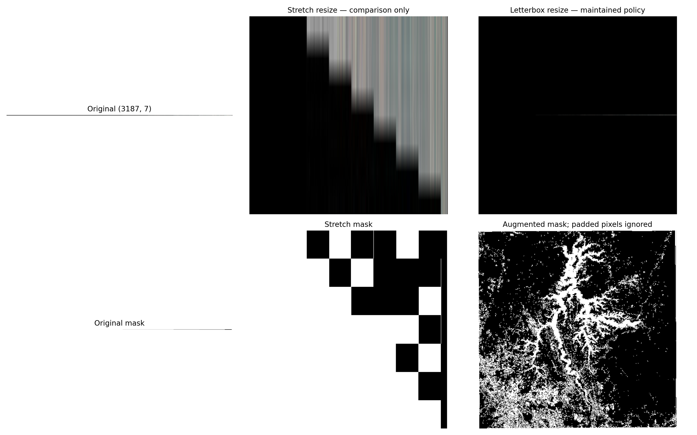
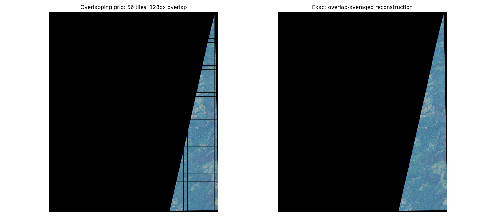
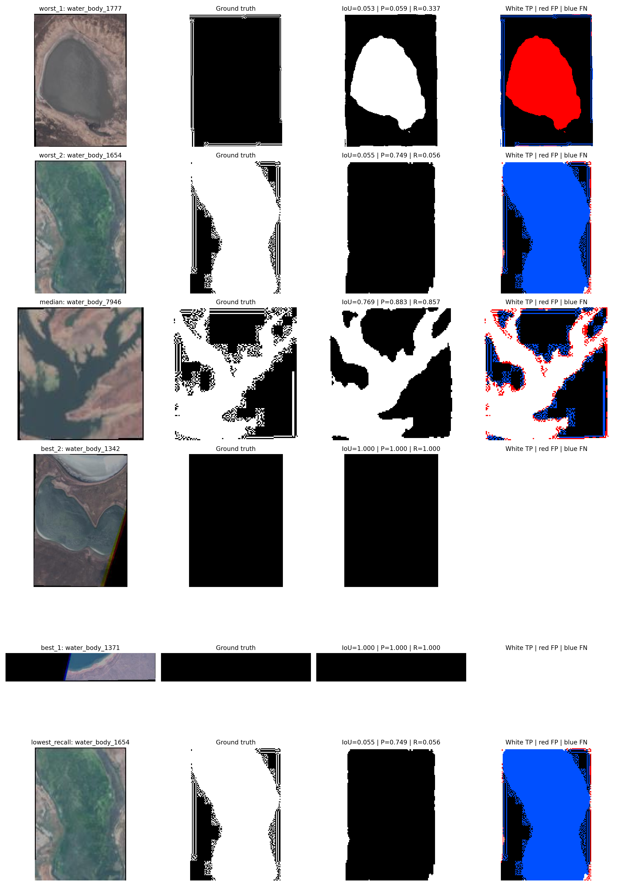
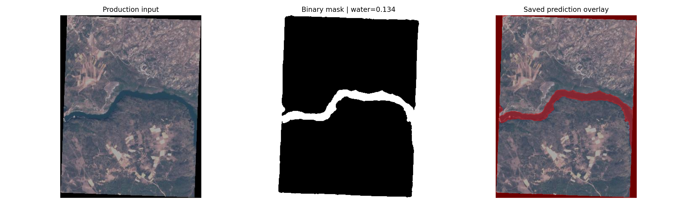

# Aereo Water-Body Segmentation — Data Science Intern Assignment

[](https://github.com/Mshrooom/Aereo-WaterSeg-DSintern-Assignment/actions/workflows/ci.yml)
[](https://github.com/Mshrooom/Aereo-WaterSeg-DSintern-Assignment/releases/tag/v3.0.0)
[](https://www.python.org/)
[](https://pytorch.org/)

A complete, production-oriented machine-learning system for automatic water-body segmentation from RGB satellite imagery.

The project combines rigorous model development with reproducible data engineering, evaluation, experiment tracking, and deployment. It compares zero-shot SAM, fine-tuned SAM, SegFormer, and a SegFormer-to-SAM hybrid, while selecting SegFormer-B0 as the final production model because it achieved the strongest balance of segmentation accuracy, boundary quality, latency, and operational simplicity.

The pipeline includes leakage-aware data splitting, Optuna-based hyperparameter optimization, same-code baseline confirmation, multi-seed stability analysis, resumable training, validation-only threshold calibration, frozen held-out test evaluation, paired statistical testing, and complete per-image result registries. **MLflow is used as the primary experiment-tracking and model-governance layer**, recording hyperparameters, metrics, checkpoints, artifacts, and model-selection evidence across HPO, confirmation, stability, training, and evaluation stages.

The repository also provides data and model registries, structured inference logging, FastAPI serving, Docker packaging, continuous integration, checksum-verified release artifacts, and reproducibility documentation. The result is not only a trained segmentation model, but a traceable end-to-end system that can be independently reviewed, reproduced, tested, and deployed.


---

## Table of contents

1. [Project objective](#project-objective)
2. [Executive results](#executive-results)
3. [Architecture](#Architecture)
4. [Dataset and split](#dataset-and-split)
5. [Scientific and reproducibility guardrails](#scientific-and-reproducibility-guardrails)
6. [Repository navigation](#repository-navigation)
7. [Quick start: use the released model](#quick-start-use-the-released-model)
8. [Environment setup](#environment-setup)
9. [Recreate the experiment](#recreate-the-experiment)
10. [Smoke profile](#smoke-profile)
11. [Full profile](#full-profile)
12. [Resume an interrupted run](#resume-an-interrupted-run)
13. [Run direct Python inference](#run-direct-python-inference)
14. [Run the FastAPI service](#run-the-fastapi-service)
15. [Call the API with an image](#call-the-api-with-an-image)
16. [Build and run Docker](#build-and-run-docker)
17. [Results and comparison](#results-and-comparison)
18. [Latency and resource results](#latency-and-resource-results)
19. [Experiment tracking and registries](#experiment-tracking-and-registries)
20. [Tests and continuous integration](#tests-and-continuous-integration)
21. [Release assets and integrity](#release-assets-and-integrity)
23. [Known limitations](#known-limitations)
24. [Recommended next improvements](#recommended-next-improvements)

---

# Project objective

The assignment objective is to build a complete machine-learning solution for water-body segmentation in satellite imagery, including:

- scalable image and mask ingestion;
- validation, normalization, augmentation, and tiling;
- end-to-end PyTorch model training;
- hyperparameter optimization;
- experiment tracking;
- data and model registries;
- optimized inference;
- request-level logging;
- FastAPI serving;
- containerized deployment;
- reproducible code, evidence, report, and presentation.

The maintained system answers two questions:

1. **Modeling:** Can a reproducible SegFormer pipeline improve or match the historical automatic SegFormer result under controlled model selection?
2. **Engineering:** Can the selected model be packaged as a traceable, integrity-checked inference service rather than remaining only in a notebook?

---

# Executive results

## Dataset

| Item | Value |
|---|---:|
| Image-mask pairs | 2,841 |
| Training images | 1,991 |
| Validation images | 429 |
| Held-out test images | 421 |
| Modalities | RGB imagery + binary water mask |
| Input dimensions | Variable |
| Production model input | 512 × 512 letterboxed |
| Output | Original-resolution binary PNG mask |

## Selected production system

| Item | Value |
|---|---|
| Architecture | SegFormer-B0 |
| Pretrained checkpoint | `nvidia/segformer-b0-finetuned-ade-512-512` |
| Output classes | 2: non-water, water |
| Resize policy | Aspect-ratio-preserving letterbox |
| Selected threshold | 0.45 |
| Loss | Cross-entropy + Dice |
| Selected loss weights | CE 0.4, Dice 0.6 |
| Selected augmentation profile | Light |
| Experiment tracker | MLflow |
| Optional mirror | W&B offline runs |
| Model version | `segformer-v3.0.0` |

## Final held-out test metrics

| Metric | V3 result |
|---|---:|
| Mean per-image IoU | **0.727625** |
| Dice | **0.825825** |
| Precision | **0.860920** |
| Recall | **0.815868** |
| Specificity | **0.910250** |
| Pixel accuracy | **0.896098** |
| Balanced accuracy | **0.863059** |
| Matthews correlation coefficient | **0.698699** |
| Cohen's kappa | **0.728508** |
| Boundary F1 | **0.655815** |
| Boundary IoU | **0.196826** |
| Global IoU | **0.904199** |
| Global Dice | **0.949689** |

## Measured inference performance

Measured on a Kaggle Tesla T4 GPU with batch size 1 and a 512 × 512 model input:

| Metric | Result |
|---|---:|
| Cold start | 143.89 ms |
| P50 model-forward latency | 12.05 ms |
| P95 model-forward latency | 20.81 ms |
| Mean model-forward latency | 13.53 ms |
| P50 end-to-end latency | 31.91 ms |
| P95 end-to-end latency | 39.53 ms |
| Mean end-to-end latency | 33.34 ms |
| Throughput | 73.92 images/s |
| Peak inference GPU memory | 283.62 MB |

Latency depends on hardware, drivers, dependency versions, storage, image dimensions, and service concurrency. The historical `8.3 ms` SegFormer result is a different model-stage timing measurement and should not be directly compared with V3 end-to-end API latency.


---

# Architecture

## Inference architecture

```text
RGB satellite image
        │
        ▼
Input validation
  - content type
  - upload size
  - pixel count
        │
        ▼
Aspect-ratio-preserving letterbox resize
        │
        ▼
SegFormer-B0
  MiT encoder + lightweight decoder
  two-class logits: non-water / water
        │
        ▼
Softmax water probability
        │
        ▼
Restore probability map to original resolution
        │
        ▼
Validation-selected threshold = 0.45
        │
        ▼
Binary water mask
  0   = non-water
  255 = water
        │
        ├── PNG response
        ├── optional overlay
        └── structured JSONL request log
```

## Training and selection architecture

```text
Raw image-mask pairs
        │
        ▼
Decode and integrity validation
        │
        ▼
Portable manifest + deterministic split registry
        │
        ▼
Exact/near-duplicate leakage audit
        │
        ▼
Synchronized augmentation + letterbox preprocessing
        │
        ▼
Optuna HPO on train/validation only
        │
        ▼
Historical same-code baseline + top-three confirmation
        │
        ▼
Three-seed stability analysis
        │
        ▼
Resumable final training
        │
        ▼
Validation-only threshold calibration
        │
        ▼
Model-selection lock
        │
        ▼
Frozen held-out test evaluation
        │
        ▼
Statistics, slices, registry, inference and API export
```

## Why SegFormer-B0

SegFormer-B0 was selected because it provides the strongest combination of:

- fully automatic prediction;
- overlap quality;
- boundary quality;
- low latency;
- small checkpoint size;
- simple serving architecture;
- no prompts, clicks, boxes, or second model at inference.

The SAM-based systems remain useful ablations, but the additional complexity did not produce a better production trade-off.

---

# Dataset and split

The project uses the **Satellite Images of Water Bodies** dataset:

- 2,841 RGB satellite images;
- 2,841 corresponding binary masks;
- variable spatial dimensions;
- water and non-water labels;
- PNG, TIFF, or GeoTIFF-compatible ingestion.

The deterministic split is:

| Split | Count | Purpose |
|---|---:|---|
| Train | 1,991 | Model fitting |
| Validation | 429 | HPO, early stopping, checkpoint selection, confirmation, threshold calibration |
| Test | 421 | Final reporting only |
| **Total** | **2,841** | |

The split is defined at the parent-image level before optional tiling. Tiles from one parent image must never cross split boundaries.

## Ingestion checks

The V3 ingestion pipeline:

1. recursively discovers candidate images and masks;
2. matches pairs by identifier/stem;
3. rejects missing or duplicate pairs;
4. verifies that every file decodes;
5. verifies image-mask spatial compatibility;
6. normalizes mask interpretation;
7. measures water coverage;
8. calculates cryptographic hashes;
9. audits exact and perceptual duplicates;
10. writes portable data and split registries.

Key evidence:

```text
evidence/registry/validated_manifest.csv
evidence/registry/runtime_manifest.csv
evidence/registry/split_registry.csv
evidence/registry/data_registry.json
evidence/registry/near_duplicate_audit.csv
```

---

# Scientific and reproducibility guardrails

The experiment is designed to prevent optimistic leakage and retrospective model selection.

- HPO, confirmation, seed stability, early stopping, and threshold selection never receive test rows.
- The HPO objective is mean per-image original-resolution validation IoU at threshold 0.50.
- The final probability threshold is selected once on validation after final training.
- A model-selection lock is written before the held-out test dataframe is materialized.
- The historical SegFormer hyperparameters are rerun through the same V3 training engine.
- Historical SAM prompt modes are selected with historical validation rows, not test rows.
- The production seed is declared before test evaluation.
- Three seeds—42, 2026, and 3407—are used to quantify stability.
- Model-forward and end-to-end latency are reported separately.
- Checkpoint hashes are stored and checked during production loading.
- Compliance is derived from generated evidence rather than hard-coded success flags.
- Smoke and full outputs use different roots and cannot be confused.

The automatic stage graph is:

```text
data
  → hpo
  → confirmation
  → stability
  → final_train
  → calibrate
  → evaluate
  → inference
  → api_test
  → export
```

---

# Repository navigation

```text
.
├── .github/
│   └── workflows/
│       └── ci.yml
├── artifacts/
│   ├── checkpoints/
│   │   └── segformer_best/
│   └── checksums/
├── evidence/api/               FastAPI smoke-test evidence
├── evidence/calibration/                  Validation threshold sweep and selection
├── configs/
│   ├── acceptance_criteria.yaml
│   └── segformer_v3.yaml
├── docs/
│   ├── dataset_card.md
│   ├── model_card.md
│   └── docker_validation/        Added after local container validation
├── evidence/evaluation/
│   ├── segformer_v3_test_metrics.json
│   ├── segformer_v3_all_2841.csv
│   └── historical_comparison.csv
├── reports/figures/                      EDA, preprocessing, tiling and error figures
├── notebooks/
│   ├── Aereo_Production_SegFormer_V3_Source.ipynb
│   ├── Aereo_Production_SegFormer_V3_Full_Run.ipynb
│   ├── Aereo_Production_SegFormer_V3_EXECUTED.ipynb
│   └── historical notebooks
├── evidence/inference/         Sample image, mask, overlay, logs and latency
├── evidence/registry/                     Data/model registry and selected model
├── requirements/
│   ├── ci.in
│   └── production.in
├── evidence/results/
│   └── full/                     Historical A-D per-image results
├── scripts/                      Training/inference/deployment utilities
├── evidence/slices/                       Performance-slice results
├── src/
│   ├── aereo_water/              Maintained V3 package
│   │   ├── api/
│   │   ├── data/
│   │   ├── evidence/evaluation/
│   │   ├── inference/
│   │   ├── models/
│   │   ├── pipeline/
│   │   └── training/
│   └── waterseg/                 Historical implementation
├── evidence/statistics/                   Paired bootstrap and Wilcoxon evidence
├── tests/                        Legacy and V3 unit/integration tests
├── deployment/Dockerfile
├── deployment/compose.yaml
├── pyproject.toml
└── README.md
```

## Where to look first

| Goal | File or directory |
|---|---|
| Understand the final workflow | `notebooks/Aereo_Production_SegFormer_V3_EXECUTED.ipynb` |
| Run a cheap validation | `notebooks/Aereo_Production_SegFormer_V3_Source.ipynb` |
| Recreate final evidence | `notebooks/Aereo_Production_SegFormer_V3_Full_Run.ipynb` |
| Inspect final test metrics | `evidence/evaluation/segformer_v3_test_metrics.json` |
| Inspect all per-image V3 results | `evidence/evaluation/segformer_v3_all_2841.csv` |
| Compare historical models | `evidence/evaluation/historical_comparison.csv` and `evidence/results/full/` |
| Inspect threshold selection | `evidence/calibration/selected_threshold.json` |
| Inspect statistical significance | `evidence/statistics/paired_comparison.json` |
| Inspect failure modes | `evidence/slices/` and `reports/figures/qualitative_success_failure_analysis.png` |
| Load the selected model | `artifacts/checkpoints/segformer_best/` |
| Verify model metadata/hash | `evidence/registry/selected_model.json` |
| Inspect API evidence | `evidence/api/` |
| Inspect latency | `evidence/inference/latency_summary.json` |
| Build the service | `deployment/Dockerfile`, `deployment/compose.yaml` |

---

# Quick start: use the released model

The quickest path does not retrain anything.

## 1. Clone

```powershell
git clone `
  https://github.com/Mshrooom/Aereo-WaterSeg-DSintern-Assignment.git

Set-Location Aereo-WaterSeg-DSintern-Assignment
```

## 2. Create an environment

```powershell
py -3.11 -m venv .venv
.\.venv\Scripts\Activate.ps1
```

When PowerShell blocks activation for the current session:

```powershell
Set-ExecutionPolicy -Scope Process Bypass
.\.venv\Scripts\Activate.ps1
```

## 3. Install

```powershell
python -m pip install --upgrade pip setuptools wheel
python -m pip install -r .
equirements\production.in
python -m pip install --no-deps --editable .
```

## 4. Verify

```powershell
python -c "import aereo_water; print(aereo_water.__version__)"
python -c "from aereo_water.inference.predictor import SegFormerPredictor; print('predictor import passed')"
python -m compileall -q src scripts
```

## 5. Get the deployment artifact

Release page:

**[Aereo Water Segmentation V3 — v3.0.0](https://github.com/Mshrooom/Aereo-WaterSeg-DSintern-Assignment/releases/tag/v3.0.0)**

The release contains or links to:

```text
aereo-water-v3-github-evidence.zip
aereo-water-segformer-v3-deployment.zip
AEREO_V3_SHA256SUMS.txt
```

Extract `aereo-water-segformer-v3-deployment.zip`. Its deployable content should include:

```text
segformer_best/
selected_model.json
```

The repository also contains the selected checkpoint and registry evidence under:

```text
artifacts/checkpoints/segformer_best/
evidence/registry/selected_model.json
```

---

# Environment setup

## Supported environment

Recommended:

- Python 3.11;
- CUDA GPU for training;
- CPU or CUDA for inference;
- Docker Desktop for container validation;
- sufficient writable disk for HPO and tracking artifacts.

The final full notebook was executed on:

```text
Python: 3.12.13
PyTorch: 2.10.0+cu128
GPU: Tesla T4
GPU memory: 14.56 GB
```

The repository CI uses Python 3.11 and a CPU PyTorch installation.

## Production dependencies

```powershell
python -m pip install -r .
equirements\production.in
```

## CI/test dependencies

```powershell
python -m pip install -r .
equirements\ci.in
```

## Editable package installation

```powershell
python -m pip install --no-deps --editable .
```

## Complete local verification

```powershell
python -m compileall -q src scripts
python -m pytest -q
```

The final executed evidence recorded 43 passing repository tests. The current GitHub Actions run is the source of truth for the latest commit.

---

# Recreate the experiment

The supported full reproduction environment is Kaggle because the full profile requires a GPU and produces substantial intermediate evidence.

## Kaggle inputs

Attach:

1. the **Satellite Images of Water Bodies** dataset containing the raw image and mask folders;
2. Internet access for the initial package/model download;
3. a GPU accelerator;
4. optionally, an extracted previous resume bundle.

The notebook clones the repository into:

```text
/kaggle/working/aereo-water-segmentation
```

Profile outputs are isolated under:

```text
/kaggle/working/aereo-water-v3-smoke
/kaggle/working/aereo-water-v3-full
```

## Notebook choices

| Notebook | Default profile | Purpose |
|---|---|---|
| `Aereo_Production_SegFormer_V3_Source.ipynb` | `smoke` | Cheap end-to-end validation |
| `Aereo_Production_SegFormer_V3_Full_Run.ipynb` | `full` | Recreate complete final experiment |
| `Aereo_Production_SegFormer_V3_EXECUTED.ipynb` | already executed | Review measured outputs without rerunning |

---

# Smoke profile

The smoke profile checks the complete path without producing scientific claims.

It uses approximately:

```text
2 completed HPO trials, up to 3 attempts
1 HPO epoch
64 HPO training images
32 HPO validation images
top-1 confirmation
1 confirmation epoch
1 stability seed
1 final-training epoch
limited evaluation subset
```

## Recommended Kaggle procedure

1. Open `notebooks/Aereo_Production_SegFormer_V3_Source.ipynb`.
2. Attach the dataset.
3. Enable GPU and Internet.
4. Confirm:

   ```python
   RUN_PROFILE = "smoke"
   RESET_OUTPUT_ROOT = False
   ```

5. Select **Run all**.
6. Confirm that smoke HPO, checkpointing, tracking, inference, API tests, and export finish.
7. Do not report smoke metrics as final performance.

## Optional command-line execution

Use only when the dataset is visible to the notebook in the current environment:

```powershell
jupyter nbconvert `
  --execute `
  --to notebook `
  --ExecutePreprocessor.timeout=-1 `
  .
otebooks\Aereo_Production_SegFormer_V3_Source.ipynb `
  --output Aereo_Production_SegFormer_V3_SMOKE_EXECUTED.ipynb
```

---

# Full profile

The full profile recreates the final V3 experiment:

```text
12 completed Optuna trials, with up to 20 attempts
4 HPO epochs on a fixed 1,000-image training subset
all 429 validation images
same-code historical baseline plus top three HPO candidates
6 confirmation epochs
three-seed stability: 42, 2026, 3407
up to 15 epochs of resumable final training
validation-only threshold calibration
frozen 421-image held-out test evaluation
full 2,841-image inference
paired statistics and performance slices
production predictor and latency benchmark
FastAPI tests
model/data registry and evidence exports
```

## Recommended Kaggle procedure

1. First complete the smoke profile.
2. Open `notebooks/Aereo_Production_SegFormer_V3_Full_Run.ipynb`.
3. Attach the same raw dataset.
4. Enable GPU and Internet.
5. Confirm:

   ```python
   RUN_PROFILE = "full"
   RESET_OUTPUT_ROOT = False
   ```

6. Select **Run all**.
7. Preserve `/kaggle/working/aereo-water-v3-full`.
8. Download the generated evidence, deployment, checksum, and resume bundles.

## Optional command-line execution

```powershell
jupyter nbconvert `
  --execute `
  --to notebook `
  --ExecutePreprocessor.timeout=-1 `
  .
otebooks\Aereo_Production_SegFormer_V3_Full_Run.ipynb `
  --output Aereo_Production_SegFormer_V3_FULL_EXECUTED.ipynb
```

A full run can take hours and requires adequate disk. Do not launch it accidentally on a CPU-only environment.

---

# Resume an interrupted run

The stage controller loads completed artifacts and runs only missing, failed, or interrupted stages.

Final training writes `last_state.pt` and preserves:

- model state;
- optimizer state;
- scheduler state;
- gradient-scaler state;
- current epoch;
- best validation IoU;
- best epoch;
- early-stopping counter;
- training history;
- Python, NumPy, PyTorch and CUDA random states.

To resume on Kaggle:

1. extract or attach the prior `aereo-water-v3-resume.zip`;
2. set:

   ```python
   RESUME_ROOT_INPUT = Path(
       "/kaggle/input/<resume-dataset>/aereo-water-v3-full"
   )
   ```

3. keep:

   ```python
   RESET_OUTPUT_ROOT = False
   ```

4. run the notebook from the beginning.

To intentionally discard all profile-specific state:

```python
RESET_OUTPUT_ROOT = True
```

---

# Run direct Python inference

This path loads the released checkpoint without starting an API.

Create `run_v3_inference.py` in the repository root:

```python
from pathlib import Path

import torch

from aereo_water.inference.predictor import SegFormerPredictor


CHECKPOINT_DIR = Path("artifacts/checkpoints/segformer_best")
SELECTED_MODEL = Path("evidence/registry/selected_model.json")
INPUT_IMAGE = Path("sample_satellite_image.png")
OUTPUT_DIR = Path("local_inference")
OUTPUT_DIR.mkdir(parents=True, exist_ok=True)

device = torch.device(
    "cuda" if torch.cuda.is_available() else "cpu"
)

predictor = SegFormerPredictor(
    CHECKPOINT_DIR,
    selected_model_path=SELECTED_MODEL,
    image_size=512,
    resize_policy="letterbox",
    device=device,
    log_path=OUTPUT_DIR / "inference.jsonl",
    model_version="segformer-v3.0.0",
    warmup_runs=1,
)

mask, probability, metadata = predictor.predict(
    INPUT_IMAGE,
    request_id="local-example-001",
)

mask_path = predictor.save_mask(
    mask,
    OUTPUT_DIR / "predicted_water_mask.png",
)

overlay_path = predictor.save_overlay(
    INPUT_IMAGE,
    mask,
    OUTPUT_DIR / "predicted_water_overlay.png",
)

print("Device:", device)
print("Mask:", mask_path)
print("Overlay:", overlay_path)
print("Metadata:", metadata)
```

Run:

```powershell
python .
un_v3_inference.py
```

Expected outputs:

```text
local_inference/
├── predicted_water_mask.png
├── predicted_water_overlay.png
└── inference.jsonl
```

The saved mask preserves the original image width and height and uses binary values:

```text
0   = non-water
255 = water
```

---

# Run the FastAPI service

## Configure the service

From the repository root:

```powershell
$env:AEREO_CHECKPOINT = (
  Resolve-Path ".rtifacts\checkpoints\segformer_best"
).Path

$env:AEREO_SELECTED_MODEL = (
  Resolve-Path ".
egistry\selected_model.json"
).Path

$env:AEREO_DEVICE = "cpu"
$env:AEREO_IMAGE_SIZE = "512"
$env:AEREO_RESIZE_POLICY = "letterbox"
$env:AEREO_LOG_PATH = (
  Join-Path $PWD "api_inference.jsonl"
)
```

Use CUDA when available and correctly installed:

```powershell
$env:AEREO_DEVICE = "cuda"
```

Optional service hardening variables:

```powershell
$env:AEREO_MAX_UPLOAD_BYTES = "10485760"
$env:AEREO_MAX_IMAGE_PIXELS = "40000000"
$env:AEREO_MAX_CONCURRENCY = "1"
```

Start Uvicorn:

```powershell
python -m uvicorn `
  aereo_water.api.app:app `
  --host 0.0.0.0 `
  --port 8000
```

Open the interactive documentation:

```text
http://localhost:8000/docs
```

## Endpoints

| Endpoint | Method | Purpose |
|---|---|---|
| `/health` | GET | Process-level health |
| `/ready` | GET | Model readiness |
| `/metadata` | GET | Model version, threshold and configuration |
| `/segment` | POST | Upload an image and receive a binary PNG mask |

## Health and readiness

```powershell
Invoke-RestMethod http://localhost:8000/health
Invoke-RestMethod http://localhost:8000/ready
Invoke-RestMethod http://localhost:8000/metadata
```

---

# Call the API with an image

## PowerShell/curl

```powershell
curl.exe `
  -X POST `
  "http://localhost:8000/segment" `
  -F "image=@sample_satellite_image.png;type=image/png" `
  --output predicted_water_mask.png
```

## Python client

```python
from pathlib import Path

import requests


image_path = Path("sample_satellite_image.png")

with image_path.open("rb") as image_file:
    response = requests.post(
        "http://localhost:8000/segment",
        files={
            "image": (
                image_path.name,
                image_file,
                "image/png",
            )
        },
        timeout=120,
    )

response.raise_for_status()

Path("predicted_water_mask.png").write_bytes(
    response.content
)

print("Status:", response.status_code)
print("Content-Type:", response.headers.get("content-type"))
```

## Invalid-request behavior

The V3 API tests cover:

- valid image returns HTTP 200 and `image/png`;
- invalid content type returns HTTP 415;
- missing file returns HTTP 422;
- oversized upload returns HTTP 413.

The service also checks checkpoint integrity against the selected-model registry during startup.

---

# Build and run Docker

Docker runtime validation is separate from the notebook. The repository provides:

```text
deployment/Dockerfile
deployment/compose.yaml
```

## Prerequisites

- Docker Desktop is running;
- the checkpoint exists at `artifacts/checkpoints/segformer_best/`;
- `evidence/registry/selected_model.json` exists;
- port 8000 is available.

Check Docker:

```powershell
docker --version
docker info
```

## Validate Compose configuration

```powershell
docker compose `
  -f .\deployment/compose.yaml `
  config
```

## Build

```powershell
docker compose `
  -f .\deployment/compose.yaml `
  build --no-cache
```

Or build directly:

```powershell
docker build `
  -f .\deployment/Dockerfile `
  -t aereo-water-segformer:v3 .
```

## Start

```powershell
docker compose `
  -f .\deployment/compose.yaml `
  up -d
```

## Inspect

```powershell
docker compose `
  -f .\deployment/compose.yaml `
  ps

docker compose `
  -f .\deployment/compose.yaml `
  logs --tail=300
```

## Test the container

```powershell
Invoke-RestMethod http://localhost:8000/health
Invoke-RestMethod http://localhost:8000/ready
Invoke-RestMethod http://localhost:8000/metadata
```

Send an image:

```powershell
curl.exe `
  -X POST `
  "http://localhost:8000/segment" `
  -F "image=@sample_satellite_image.png;type=image/png" `
  --output docker_predicted_water_mask.png
```

## Restart validation

```powershell
docker compose `
  -f .\deployment/compose.yaml `
  restart

Invoke-RestMethod http://localhost:8000/ready
```

Run inference again after restart.

## Stop

```powershell
docker compose `
  -f .\deployment/compose.yaml `
  down
```

## Save validation evidence

```text
docs/docker_validation/
├── docker_build.log
├── docker_run.log
├── container_logs.txt
├── health_response.json
├── readiness_response.json
├── metadata_response.json
├── predicted_mask.png
└── docker_validation_summary.json
```

Do not mark Docker validation complete until build, startup, valid request, invalid request, restart, post-restart inference, logs, and clean shutdown have been tested.

---

# Results and comparison

## Historical experiments versus V3

| System | Inference mode | Test IoU | Dice | Boundary F1 |
|---|---|---:|---:|---:|
| Zero-shot SAM | Oracle-prompt benchmark | 0.566666 | 0.688989 | 0.354419 |
| Fine-tuned SAM | Prompted | 0.603761 | 0.735317 | 0.392837 |
| Original SegFormer | Automatic | 0.718995 | 0.819071 | 0.598512 |
| SegFormer-SAM hybrid | Automatic two-model pipeline | 0.609329 | 0.735206 | 0.413059 |
| **Production SegFormer V3** | **Automatic** | **0.727625** | **0.825825** | **0.655815** |

## Paired comparison against historical SegFormer

| Statistic | Result |
|---|---:|
| Mean per-image IoU improvement | +0.008631 |
| 95% paired-bootstrap CI | [0.002960, 0.014245] |
| Images improved | 61.28% |
| Images degraded | 34.92% |
| Images unchanged | 3.80% |
| Wilcoxon p-value | 1.14 × 10⁻⁹ |

## Performance slices

| Slice | Mean IoU |
|---|---:|
| 0–10% water coverage | 0.462659 |
| 10–25% | 0.699341 |
| 25–50% | 0.752054 |
| 50–75% | 0.786368 |
| 75–100% | 0.862322 |
| Low boundary complexity | 0.874093 |
| Medium boundary complexity | 0.758354 |
| High boundary complexity | 0.550209 |

## Figures

### Dataset exploration



### Preprocessing and augmentation



### Tiling and reconstruction



### Qualitative successes and failures



### Production inference



---

# Latency and resource results

## Model-forward latency

```text
Warm-up runs: 5
Timed runs: 50
P50: 12.05 ms
P95: 20.81 ms
Mean: 13.53 ms
Throughput: 73.92 images/s
Peak inference GPU memory: 283.62 MB
```

## End-to-end latency

```text
Cold start: 143.89 ms
P50: 31.91 ms
P95: 39.53 ms
Mean: 33.34 ms
```

Evidence:

```text
evidence/inference/end_to_end_latency.csv
evidence/inference/latency_summary.json
evidence/inference/inference.jsonl
```

---

# Experiment tracking and registries

## MLflow

MLflow is the system of record. It stores HPO, confirmation, stability, final-training and evaluation runs.

The complete Kaggle output preserves:

```text
tracking/mlflow.db
tracking/mlartifacts/
```

## W&B

W&B is an optional visualization mirror. The executed full run used offline mode under:

```text
tracking/wandb/
```

No W&B account is required for offline reproduction.

## Data registry

```text
evidence/registry/data_registry.json
evidence/registry/validated_manifest.csv
evidence/registry/runtime_manifest.csv
evidence/registry/split_registry.csv
```

## Model registry

```text
evidence/registry/selected_model.json
evidence/registry/model_registry.csv
```

The selected-model record stores the checkpoint hash, threshold, preprocessing, parameters, metrics, latency, Git commit, HPO fingerprint and deployment status.

---

# Tests and continuous integration

Canonical workflow:

```text
.github/workflows/ci.yml
```

For pushes and pull requests to `main`, CI:

1. installs Python 3.11;
2. installs CPU PyTorch;
3. installs production and CI dependencies;
4. installs the repository editable;
5. verifies critical imports;
6. compiles source and scripts;
7. runs `pytest`.

Local commands:

```powershell
python -m compileall -q src scripts
python -m pytest -q
```

The final executed evidence recorded 43 passing tests. The current GitHub Actions run is the source of truth for the latest commit.

---

# Release assets and integrity

Release:

**[v3.0.0 — Aereo Water Segmentation V3](https://github.com/Mshrooom/Aereo-WaterSeg-DSintern-Assignment/releases/tag/v3.0.0)**

Assets:

```text
aereo-water-v3-github-evidence.zip
aereo-water-segformer-v3-deployment.zip
AEREO_V3_SHA256SUMS.txt
```

The large resume/recovery bundle may be retained separately because it contains intermediate state and is not required for review, inference or deployment.

Verify a download:

```powershell
Get-FileHash `
  .ereo-water-segformer-v3-deployment.zip `
  -Algorithm SHA256

Get-Content .\AEREO_V3_SHA256SUMS.txt
```

The deployment artifact was also reloaded in a clean directory during notebook execution; prediction-mask parity and checkpoint-hash parity passed.

---

# Known limitations

1. **RGB only.** NIR and SWIR bands are unavailable.
2. **Geographic generalization is not established.** Region and time metadata are incomplete.
3. **No empty-mask examples in the held-out test set.** All 421 test masks contain water, so empty-scene false-positive rate is `NOT_APPLICABLE`, not zero.
4. **Reference-label quality.** Some masks may reflect automated or index-assisted processing.
5. **Historical and V3 latency scopes differ.**
6. **Docker validation is external to the Kaggle notebook.**
7. **The API does not yet include production authentication, rate limiting or distributed serving.**
8. **No ONNX, TensorRT or quantized export is included yet.**
9. **Latency will vary by hardware and concurrency.**

---

# Recommended next improvements

- add NIR and SWIR bands;
- evaluate geographic and temporal OOD splits;
- add manually verified dry-land negative controls;
- export ONNX and benchmark ONNX Runtime;
- add cloud, haze and seasonal corruption tests;
- use metre-based boundary metrics when georeferencing is valid;

---

# Project provenance

Developed for the Aereo Data Scientist Intern water-body segmentation assignment.

The repository preserves production code, measured evidence, model and dataset cards, executed notebook, release artifacts and CI history so reported claims can be traced to source code and generated artifacts.
